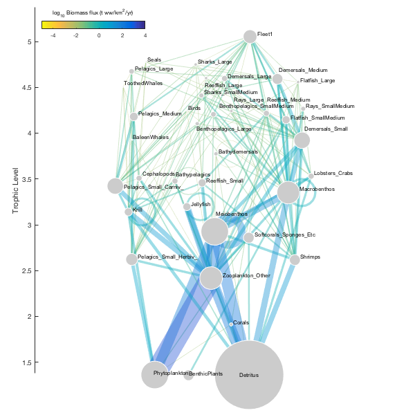

# foodwebgraph.m: Interactive food web diagrams for Ecopath


Author: Kelly Kearney


This repository includes the Matlab code to perform the trophic group calculations, JSON file formatting, and divided edge bundling calculations necessary to plot food webs with the [d3-foodweb](TODO) D3 plugin.


The d3-foodweb plugin, and this accompanying code, is currently a work in progress.  It is being developed alongside the writing of a manuscript describing the underlying algorithms.  Documentation and examples will improve as this manuscript progresses.


## Contents


- Getting started        
- Syntax        
- Examples        
- Contributions

## Getting started


**Prerequisites**


This function requires Matlab R2014b or later.


**Downloading and installation**


This code can be downloaded from [Github](https://github.com/kakearney/foodwebgraph-pkg/).


**Matlab Search Path**


The following folders need to be added to your Matlab Search path (via `addpath`, `pathtool`, etc.):


```matlab
foodwebgraph-pkg/ConsoleProgressBar
foodwebgraph-pkg/InterPointDistanceMatrix
foodwebgraph-pkg/PARTITIONS
foodwebgraph-pkg/aggregate
foodwebgraph-pkg/catuneven
foodwebgraph-pkg/cellstr2
foodwebgraph-pkg/cprintf
foodwebgraph-pkg/divedgebundle
foodwebgraph-pkg/ecopath_matlab
foodwebgraph-pkg/foodwebgraph
foodwebgraph-pkg/gauzensgroup
foodwebgraph-pkg/interparc
foodwebgraph-pkg/jsonlab-1.0
foodwebgraph-pkg/legendflex
foodwebgraph-pkg/mergestruct
foodwebgraph-pkg/minmax
foodwebgraph-pkg/readtext
foodwebgraph-pkg/regexpfound
foodwebgraph-pkg/setgetpos_V1.2
foodwebgraph-pkg/singlepatch
foodwebgraph-pkg/vlookup
foodwebgraph-pkg/wraptext
```


## Syntax


This package includes a number of Matlab functions.  The primary ones of interest are:


- trophicgroup: Cluster food web nodes based on trophic similarity
- fwgraph2json: Export graph to JSON format for use with d3-foodweb
- foodweblayout: Interactive food web layout tool
- plotfoodweb: Plot food web in Matlab

Please see the help headers (viewable via the `help` command from the Matlab Command Window) for each function for a description of calling syntax, input variables, and output variables.


## Examples


This example will demonstrate the entire food web graph process, using the Generic_37 Ecopath model (this model is included with the [Ecopath with Ecosim)](http://ecopath.org/) software, and represents a generic pelagic fisheries ecosystem).


**Step 1:** Read an Ecopath model into Matlab.


```matlab
epfile = 'examples/Generic_37.EwEmdb';

w = warning('off');                % turning off warnings
EM = mdb2ecopathmodel(epfile);     % since this spits out a lot...
warning(w);                        % ...and back on
```


**Step 2:** Isolate trophic groups in the food web


The simulated annealing algorithm does a pretty good job optimizing the trophic groups, but its inherent randomness means it doesn't always find the global optimum, especially when dealing with food webs, like this one, whose functional groups are already grouped at a high level (as opposed to webs with lots of individual species groups).


You can run the algorithm multiple times in order to try to ensure a "best" grouping.  In this example, I'll simply seed the random number generator to ensure replicability; this is only for example purposes, and a one-time optimized result is sufficient.


```matlab
rng(8);

[tg, Stmp, G] = trophicgroup(EM, 'method', 'simulatedannealing', ...
'verbose', false);
```


**Step 3:** Sort trophic groups.


The layout tool used in the next step assigns an initial vertical (y-axis) position to each node based on its trophic level.  The horizontal dimension doesn't have an equivalent restriction, so for initialization the nodes are simply placed left to right according to their trophic group number.  The `trophicgroup` algorithm assigns numbers to the groups it finds randomly, so this means the initial horizontal position of each group of nodes is random.  If we instead want initial placement to reflect some characteristic of the food web, we can sort these numbers based on that characteristic.


```matlab
% Sort based on fraction of input originating from detritus

detfrac = sourcefraction(EM.graph('oos', false, 'det', false), {'Detritus'});

dfracavg = accumarray(tg, detfrac, [max(tg) 1], @mean);
[~,isrt] = sort(dfracavg);
[~, tgsorted] = ismember(tg, isrt);
```


**Step 4:** Save graph to JSON format


This step isn't necessary if you're planning to do all your plotting from within Matlab, using the foodweblayout function.  However, if you plan to do anything with this food web outside of Matlab (e.g. add a plot to a webpage), you will want to save graph to a JSON file.  At this stage in the process, the data will include all properties necessary to run d3.foodweblayout.


```matlab
fwgraph2json(G, tgsorted, fullfile('examples', 'gen37.json'));
```


**Step 5:** Run the layout tool


Now it's time to set the positions for the nodes.  The `foodweblayout` function provides a wrapper around d3.foodweblayout, launching an web page in the Matlab browser that lets you play around with the various parameters and make manual adjustments to node position.  When you're done, click the checkbox in the lower left; this will close the browser and the function will retrieve the information from the visualization (node location, node radius, text label location) and add it to the Node table in the returned graph object.


```
[Gpos, Ax, P] = foodweblayout(G, tgsorted);
```


Here are the parameters I chose for this food web:


```matlab
P
```


```

P = 

struct with fields:

marl: 50
marr: 10
mart: 10
marb: 60
totwidth: 500
totheight: 500
nodepad: 10
strengthflxlink: 0.001
strengthgrplink: 0.1
strengthtrophic: 1.5
strengthxcenter: 0.03
tlmin: 1
tlmax: 5
rmin: 1
rmax: 50
bmin: NaN
bmax: NaN


```


At this point, we can plot the food web using straight line edges.  We can do this in Matab:


```matlab
h = plotfoodweb(Gpos, Ax, 'p', 1/3, 'w', 50, 'rloop', 40, ...
'edgecolor', 'byValue', 'initial', true, 'gmax', 500);

% Color edges by log of weight

h.edg.CData = log10(h.edg.CData);
set(h.ax, 'clim', [-5 4]);
colormap(flipud(parula));

% Add a colorbar for reference

h.cb = colorbar('north');
setpos(h.cb, '# 0.93 0.25 0.02');
title(h.cb, 'log_{10} Biomass flux (t ww/km^2/yr)');
set(h.cb, 'fontsize', 8);

% Outline nodes in white, for clarity

set(h.nd, 'edgecolor', 'w');
```




We could also save the graph data to a JSON file, and create an interactive web plot using d3.foodwebstatic.


```matlab
fwgraph2json(Gpos, tgsorted, fullfile('examples', 'gen37_postlayout.json'));
```


**Step 6:** Edge bundling


The edge bundling algorithm calculates new bundled pathways for each edge.  This process highlights the major pathways of biomass through the food web, and can often make a cluttered spaghetti diagram much more informative.


For most food webs, you'll want to apply some sort of scaling to the edge weight values.  I find that a logarithmic transform works well for most food webs.  Keep in mind that the final edge weights returned by the function must remain positive.


```matlab
% Scale edges

wlim = minmax(log10(Gpos.Edges.Weight), 'expand', 0.01);
wtfun = @(x) log10(x) - wlim(1);

% Bundle edges

Gbdl = debundle(Gpos, 'edgefun', wtfun, 'l', 100);
```


```
Preprocessing...
100% [=================================================&gt;]  176/ 176
Elapsed time is 0.780372 seconds.
Bundling...
Pass 1
100% [=================================================&gt;] Pass 1: 29 of 29
Elapsed time is 0.510903 seconds.
Pass 2
100% [=================================================&gt;] Pass 2: 29 of 29
Elapsed time is 1.403186 seconds.
Pass 3
100% [=================================================&gt;] Pass 3: 29 of 29
Elapsed time is 3.242223 seconds.
Pass 4
100% [=================================================&gt;] Pass 4: 29 of 29
Elapsed time is 6.960158 seconds.
Pass 5
100% [=================================================&gt;] Pass 5: 29 of 29
Elapsed time is 14.266604 seconds.
Postprocessing...
Done

```


We can save a new version of the JSON file, now containing edge path coordinates.


```matlab
fwgraph2json(Gbdl, tg, fullfile('examples', 'gen37_postbundle'));
```


We can also plot as we did in the previous example, now using those path coordinates for the edges.


```matlab
h = plotfoodweb(Gbdl, Ax, 'p', 1/3, 'w', 50, 'rloop', 40, ...
'edgecolor', 'byValue', 'gmax', 500, 'cthresh', 0.5);

% Color edges by log of weight

h.edg.CData = log10(h.edg.CData);
set(h.ax, 'clim', [-5 4]);
colormap(flipud(parula));

% Add a colorbar for reference

h.cb = colorbar('north');
setpos(h.cb, '# 0.93 0.25 0.02');
title(h.cb, 'log_{10} Biomass flux (t ww/km^2/yr)');
set(h.cb, 'fontsize', 8);

% Outline nodes in white, for clarity

set(h.nd, 'edgecolor', 'w');
```


## Contributions


Community contributions to this package are welcome!


To report bugs, please submit [an issue](https://github.com/kakearney/foodwebgraph-pkg/issues) on GitHub and include:


- your operating system
- your version of Matlab and all relevant toolboxes (type `ver` at the Matlab command line to get this info)
- code/data to reproduce the error or buggy behavior, and the full text of any error messages received

Please also feel free to submit enhancement requests, or to send pull requests (via GitHub) for bug fixes or new features.


I do monitor the MatlabCentral FileExchange entry for any issues raised in the comments, but would prefer to track issues on GitHub.


<sub>[Published with MATLAB R2016b]("http://www.mathworks.com/products/matlab/")</sub>
